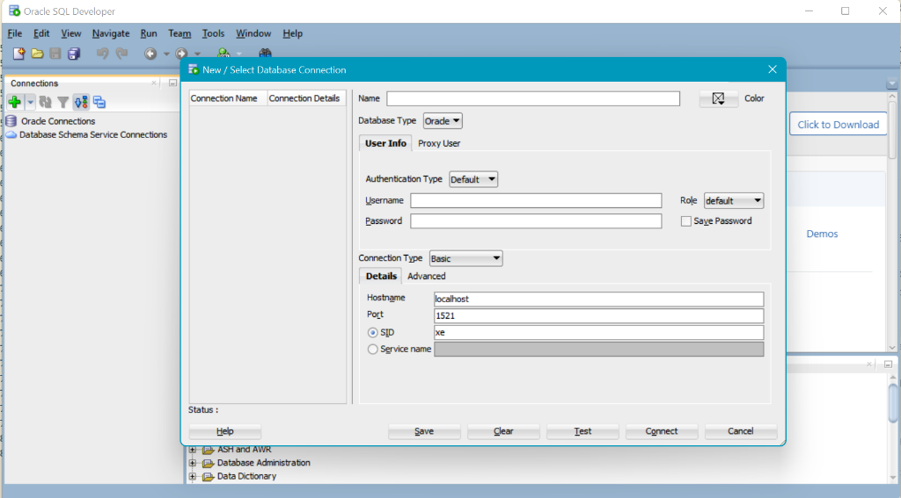
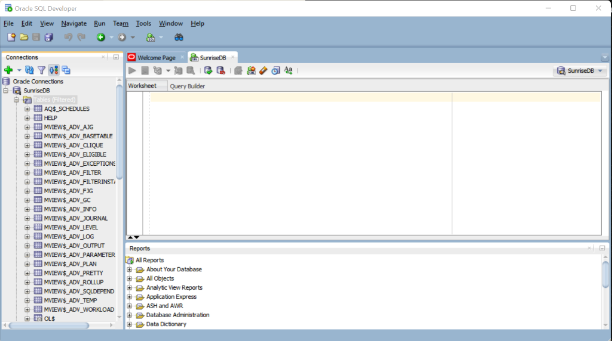
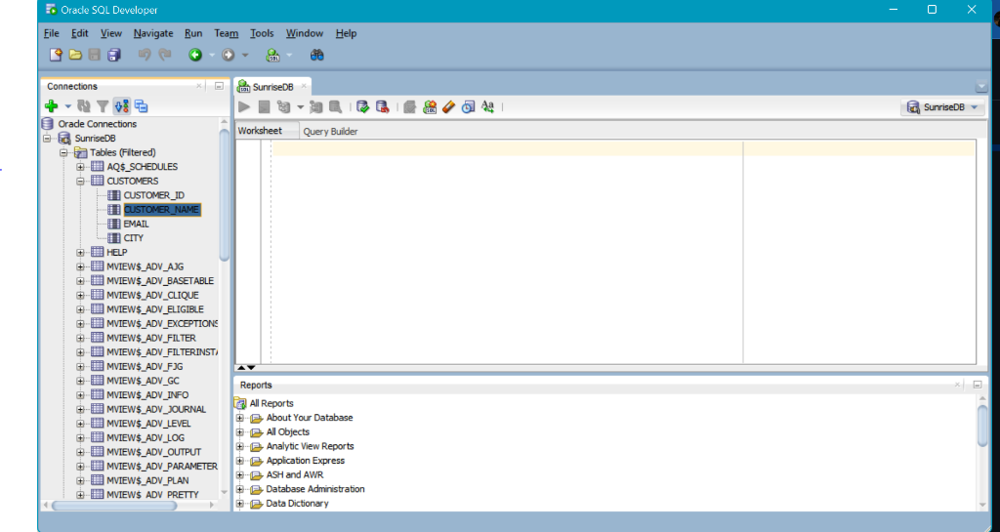

# PL/SQL Assignment One - Sunrise Supermarket Database Analysis

## 👤 Student Information & Submission Details
* **Student Name:** MUSAFIRI Arnold
* **Student ID:** 20252IMA134
* **Academic Group:** Group I (Monday Group I)
* **Repository Name:** `assignment_1_musafiri_arnold-20252IMA134`
* **DBMS & Environment:** Oracle SQL Developer Version 26.2.0.186.2220 (Oracle Enterprise Edition / PL/SQL Database)
* **Currency Unit:** Rwandan Francs (RWF / Frw)
* **Submission Deadline:** September 23, 2026, 5:00 PM

---

## 📌 1. Executive Summary & Quick Start

### 📝 Summary of Work Done
This project implements a relational database solution and advanced analytical query suite for **Sunrise Supermarket**, using **Rwandan Francs (RWF)** as the monetary currency, **authentic Rwandan customer names**, and **Rwandan product names**. The objective is to assist supermarket executive management in understanding customer purchasing behavior, product category performance, repeat ordering habits, and temporal sales revenue trends.

Key deliverables completed in this repository:
1. **Relational Database Design**: Created 4 normalized tables (`customers`, `products`, `orders`, `order_items`) enforcing primary keys, foreign keys, and strict data integrity constraints.
2. **Data Population**: Populated the database with 6 Rwandan customers located across Rwanda (Mugisha Keza - Kigali, Habimana Jean - Musanze, Uwase Divine - Rubavu, Manzi Eric - Huye, Ishimwe Chantal - Kayonza, Niyonzima Patrick - Rusizi), 8 Rwandan products priced in RWF across 5 categories (`Dairy`, `Bakery`, `Produce`, `Grocery`, `Beverages`), 15 orders, and 25 order items across dates ranging from January to June 2026.
3. **Advanced SQL Query Implementation**:
   * **3 JOIN Queries**: Multi-table INNER JOINs for orders and itemized line totals in RWF, and a LEFT JOIN to identify non-ordering customers.
   * **1 CTE Query**: Common Table Expression computing total spend per customer in RWF and filtering top-tier spenders exceeding the store average.
   * **4 Window Function Queries**: Customer revenue ranking (`RANK()`), sequential order tracking (`ROW_NUMBER()`), cumulative running revenue (`SUM() OVER (...)`), and order cycle gap analysis (`LAG()`).
4. **Business Intelligence Synthesis**: Provided actionable managerial insights for each query output contextually framed for the Rwandan retail market.

---

### 🚀 How to Run the Script in Oracle SQL Developer

1. **Prerequisites**:
   * Oracle SQL Developer (Version 26.2.0.186.2220 or compatible).
   * Connection credentials to an active Oracle Database instance (Oracle 12c, 19c, 21c, 23c, or XE).

2. **Step-by-Step Execution Guide**:
   * Open **Oracle SQL Developer**.
   * Connect to your Oracle Database schema (e.g., `system`, `hr`, or your assigned student schema).
   * File -> Open -> Select `sunrise_supermarket.sql` from your local clone of `assignment_1_musafiri_arnold-20252IMA134`.
   * Ensure your worksheet connection dropdown points to your active database connection (`SunriseDB`).
   * Press **`F5`** (or click the **"Run Script"** icon on the worksheet toolbar) to execute the entire script from schema creation to data insertion, `COMMIT`, and analytical queries.
   * View query results sequentially in the **"Script Output"** panel or execute individual query blocks using **`Ctrl + Enter`** (`Cmd + Enter` on macOS) to view formatted tabular grids in **"Query Result"**.

---

## 🏢 2. Business Scenario & Data Architecture

### 🏬 Business Context
**Sunrise Supermarket** operates as a retail supermarket chain selling daily essentials, fresh produce, beverages, and household goods across major urban hubs in Rwanda. Management identified key decision-making blind spots:
* Who are the most loyal and highest-value customers in Rwanda?
* Which product categories generate consistent basket sizes in Rwandan Francs (RWF)?
* How is overall revenue accumulating over the operational quarter?
* How frequently do repeat customers return to place subsequent orders?

To resolve these questions, a relational data schema was constructed:

### 📐 Database Schema & Entity Relationships

```
+------------------+         +------------------+
|    CUSTOMERS     |         |      ORDERS      |
+------------------+         +------------------+
| customer_id (PK) |<-------1| order_id (PK)    |
| customer_name    |         | customer_id (FK) |
| email            |         | order_date       |
| city             |         +------------------+
+------------------+                  ^
                                      | 1
                                      |
                                      | N
                             +------------------+         +------------------+
                             |   ORDER_ITEMS    |         |     PRODUCTS     |
                             +------------------+         +------------------+
                             | order_item_id(PK)|         | product_id (PK)  |
                             | order_id (FK)    |N------->| product_id (FK)  |
                             | product_id (FK)  |         | product_name     |
                             | quantity         |         | category         |
                             +------------------+         | price (RWF)      |
                                                          +------------------+
```

### 📦 Product Catalog (Rwandan Products)

| Product ID | Product Name | Category | Unit Price (RWF) |
| :--- | :--- | :--- | :--- |
| 1 | Amata 1L (Milk) | Dairy | 1,500.00 |
| 2 | Amavuta 500g (Butter) | Dairy | 4,250.00 |
| 3 | Umugati (Bread) | Bakery | 3,500.00 |
| 4 | Igitoki (Banana Bunch) | Produce | 1,250.00 |
| 5 | Umuceri 5kg (Rice) | Grocery | 12,000.00 |
| 6 | Amashaza 1kg (Peas) | Grocery | 8,750.00 |
| 7 | Fanta 1L | Beverages | 2,800.00 |
| 8 | Amazi x6 (Water) | Beverages | 4,600.00 |

---

## 📸 3. Screenshots & Database Proof of Execution

### 🔌 3.1 Connection & Database Setup in Oracle SQL Developer
* **Connection Details**: Oracle SQL Developer connected to Oracle Database instance (`SunriseDB` on `localhost:1521/FREE`).



---

### 🖥️ 3.2 SQL Developer Workspace & Active Connection
* **Connected Workspace**: Connection established successfully with active SQL Worksheet.



---

### 📁 3.3 Database Tables Hierarchy
* **Schema Object Explorer**: Displaying database tables under `SunriseDB`.



---

### 📐 3.4 Table Column Definitions (`ORDER_ITEMS` Structure)
* **Table Design**: Data types and constraints for `ORDER_ITEMS` (`ORDER_ITEM_ID`, `ORDER_ID`, `PRODUCT_ID`, `QUANTITY`).


---

### 📊 3.5 Inserted Data Screenshots (Database Verification)

Below are the screenshots and data grid verifications for the records inserted into each database table:

#### 1️⃣ `CUSTOMERS` Table Data (6 Rwandan Customers)


| CUSTOMER_ID | CUSTOMER_NAME | EMAIL | CITY |
| :--- | :--- | :--- | :--- |
| 1 | Mugisha Keza | mugishakeza@gmail.com | Kigali |
| 2 | Habimana Jean | habimanajean@gmail.com | Musanze |
| 3 | Uwase Divine | uwasedivine@gmail.com | Rubavu |
| 4 | Manzi Eric | manzieric@gmail.com | Huye |
| 5 | Ishimwe Chantal | ishimwechantal@gmail.com | Kayonza |
| 6 | Niyonzima Patrick | niyonzimapatrick@gmail.com | Rusizi |

#### 2️⃣ `PRODUCTS` Table Data (8 Rwandan Products)


| PRODUCT_ID | PRODUCT_NAME | CATEGORY | PRICE (RWF) |
| :--- | :--- | :--- | :--- |
| 1 | Amata 1L | Dairy | 1,500.00 |
| 2 | Amavuta 500g | Dairy | 4,250.00 |
| 3 | Umugati | Bakery | 3,500.00 |
| 4 | Igitoki (Bunch) | Produce | 1,250.00 |
| 5 | Umuceri 5kg | Grocery | 12,000.00 |
| 6 | Amashaza 1kg | Grocery | 8,750.00 |
| 7 | Fanta 1L | Beverages | 2,800.00 |
| 8 | Amazi x6 | Beverages | 4,600.00 |

#### 3️⃣ `ORDERS` Table Data (15 Orders)


| ORDER_ID | CUSTOMER_ID | ORDER_DATE |
| :--- | :--- | :--- |
| 101 | 1 | 2026-01-05 |
| 102 | 2 | 2026-01-08 |
| 103 | 1 | 2026-01-19 |
| 104 | 3 | 2026-02-02 |
| 105 | 4 | 2026-02-10 |
| 106 | 2 | 2026-02-14 |
| 107 | 1 | 2026-03-01 |
| 108 | 5 | 2026-03-05 |
| 109 | 3 | 2026-03-18 |
| 110 | 2 | 2026-04-02 |
| 111 | 4 | 2026-04-15 |
| 112 | 1 | 2026-04-22 |
| 113 | 3 | 2026-05-06 |
| 114 | 5 | 2026-05-20 |
| 115 | 2 | 2026-06-03 |

#### 4️⃣ `ORDER_ITEMS` Table Data (25 Line Items)


| ORDER_ITEM_ID | ORDER_ID | PRODUCT_ID | QUANTITY |
| :--- | :--- | :--- | :--- |
| 1 | 101 | 1 | 4 |
| 2 | 101 | 3 | 2 |
| 3 | 102 | 5 | 1 |
| 4 | 102 | 7 | 3 |
| 5 | 103 | 2 | 2 |
| 6 | 103 | 4 | 6 |
| 7 | 104 | 6 | 1 |
| 8 | 104 | 8 | 2 |
| 9 | 105 | 1 | 6 |
| 10 | 105 | 3 | 1 |
| 11 | 106 | 5 | 2 |
| 12 | 107 | 7 | 2 |
| 13 | 107 | 2 | 1 |
| 14 | 108 | 4 | 10 |
| 15 | 108 | 8 | 1 |
| 16 | 109 | 6 | 2 |
| 17 | 109 | 1 | 3 |
| 18 | 110 | 3 | 3 |
| 19 | 111 | 5 | 1 |
| 20 | 111 | 7 | 4 |
| 21 | 112 | 8 | 3 |
| 22 | 112 | 4 | 4 |
| 23 | 113 | 2 | 3 |
| 24 | 114 | 6 | 1 |
| 25 | 115 | 5 | 1 |

---

## 📊 4. Detailed Query Documentation & Business Interpretation

---

### 🔹 JOIN Queries

#### Query 1.1: Order Details with Customer Profile (INNER JOIN)
* **Business Requirement**: List every order along with the customer's name, city in Rwanda, and order date to map order activity geographically.
* **SQL Query**:
```sql
SELECT o.order_id,
       c.customer_name,
       c.city,
       o.order_date
FROM   orders o
INNER JOIN customers c ON c.customer_id = o.customer_id
ORDER BY o.order_date, o.order_id;
```
* **Explanation**: An `INNER JOIN` matches rows in `orders` with corresponding rows in `customers` where `c.customer_id = o.customer_id`. Orders without a matching customer are excluded.
* **Query Results**:

| ORDER_ID | CUSTOMER_NAME | CITY | ORDER_DATE |
| :--- | :--- | :--- | :--- |
| 101 | Mugisha Keza | Kigali | 2026-01-05 |
| 102 | Habimana Jean | Musanze | 2026-01-08 |
| 103 | Mugisha Keza | Kigali | 2026-01-19 |
| 104 | Uwase Divine | Rubavu | 2026-02-02 |
| 105 | Manzi Eric | Huye | 2026-02-10 |
| 106 | Habimana Jean | Musanze | 2026-02-14 |
| 107 | Mugisha Keza | Kigali | 2026-03-01 |
| 108 | Ishimwe Chantal | Kayonza | 2026-03-05 |
| 109 | Uwase Divine | Rubavu | 2026-03-18 |
| 110 | Habimana Jean | Musanze | 2026-04-02 |
| 111 | Manzi Eric | Huye | 2026-04-15 |
| 112 | Mugisha Keza | Kigali | 2026-04-22 |
| 113 | Uwase Divine | Rubavu | 2026-05-06 |
| 114 | Ishimwe Chantal | Kayonza | 2026-05-20 |
| 115 | Habimana Jean | Musanze | 2026-06-03 |

* **Business Interpretation**: Order traffic spans major Rwandan cities (Kigali, Musanze, Rubavu, Huye, Kayonza). Customers in Kigali (Mugisha Keza) and Musanze (Habimana Jean) show the highest purchase frequency with 4 orders each.

---

#### Query 1.2: Order Line Itemized Financial Breakdown in RWF (INNER JOIN)
* **Business Requirement**: List every order item with product name, category, unit price (RWF), quantity purchased, and computed total line cost in Rwandan Francs.
* **SQL Query**:
```sql
SELECT oi.order_item_id,
       oi.order_id,
       p.product_name,
       p.category,
       p.price AS price_rwf,
       oi.quantity,
       (p.price * oi.quantity) AS line_total_rwf
FROM   order_items oi
INNER JOIN products p ON p.product_id = oi.product_id
ORDER BY oi.order_item_id;
```
* **Explanation**: Merges `order_items` with `products` on `product_id` to evaluate item-level revenue in RWF. The calculated column `line_total_rwf` multiplies unit `price` by `quantity`.
* **Query Results**:

| ORDER_ITEM_ID | ORDER_ID | PRODUCT_NAME | CATEGORY | PRICE (RWF) | QUANTITY | LINE_TOTAL (RWF) |
| :--- | :--- | :--- | :--- | :--- | :--- | :--- |
| 1 | 101 | Amata 1L | Dairy | 1,500.00 | 4 | 6,000.00 |
| 2 | 101 | Umugati | Bakery | 3,500.00 | 2 | 7,000.00 |
| 3 | 102 | Umuceri 5kg | Grocery | 12,000.00 | 1 | 12,000.00 |
| 4 | 102 | Fanta 1L | Beverages | 2,800.00 | 3 | 8,400.00 |
| 5 | 103 | Amavuta 500g | Dairy | 4,250.00 | 2 | 8,500.00 |
| 6 | 103 | Igitoki (Bunch) | Produce | 1,250.00 | 6 | 7,500.00 |
| 7 | 104 | Amashaza 1kg | Grocery | 8,750.00 | 1 | 8,750.00 |
| 8 | 104 | Amazi x6 | Beverages | 4,600.00 | 2 | 9,200.00 |
| 9 | 105 | Amata 1L | Dairy | 1,500.00 | 6 | 9,000.00 |
| 10 | 105 | Umugati | Bakery | 3,500.00 | 1 | 3,500.00 |
| 11 | 106 | Umuceri 5kg | Grocery | 12,000.00 | 2 | 24,000.00 |
| 12 | 107 | Fanta 1L | Beverages | 2,800.00 | 2 | 5,600.00 |
| 13 | 107 | Amavuta 500g | Dairy | 4,250.00 | 1 | 4,250.00 |
| 14 | 108 | Igitoki (Bunch) | Produce | 1,250.00 | 10 | 12,500.00 |
| 15 | 108 | Amazi x6 | Beverages | 4,600.00 | 1 | 4,600.00 |
| 16 | 109 | Amashaza 1kg | Grocery | 8,750.00 | 2 | 17,500.00 |
| 17 | 109 | Amata 1L | Dairy | 1,500.00 | 3 | 4,500.00 |
| 18 | 110 | Umugati | Bakery | 3,500.00 | 3 | 10,500.00 |
| 19 | 111 | Umuceri 5kg | Grocery | 12,000.00 | 1 | 12,000.00 |
| 20 | 111 | Fanta 1L | Beverages | 2,800.00 | 4 | 11,200.00 |
| 21 | 112 | Amazi x6 | Beverages | 4,600.00 | 3 | 13,800.00 |
| 22 | 112 | Igitoki (Bunch) | Produce | 1,250.00 | 4 | 5,000.00 |
| 23 | 113 | Amavuta 500g | Dairy | 4,250.00 | 3 | 12,750.00 |
| 24 | 114 | Amashaza 1kg | Grocery | 8,750.00 | 1 | 8,750.00 |
| 25 | 115 | Umuceri 5kg | Grocery | 12,000.00 | 1 | 12,000.00 |

* **Business Interpretation**: High-value staple items like Umuceri 5kg (12,000 RWF) produce significant line revenues (24,000 RWF in Order 106), while high-volume items like Igitoki (1,250 RWF per bunch, 10 units in Order 108) drive store traffic through everyday produce demand.

---

#### Query 1.3: Customer Order Coverage (LEFT JOIN)
* **Business Requirement**: Display all registered customers and their associated orders, ensuring customers who have never placed an order are included.
* **SQL Query**:
```sql
SELECT c.customer_id,
       c.customer_name,
       o.order_id,
       o.order_date
FROM   customers c
LEFT JOIN orders o ON o.customer_id = c.customer_id
ORDER BY c.customer_id, o.order_date;
```
* **Explanation**: `LEFT JOIN` retains all records from `customers` regardless of whether matching records exist in `orders`. Where no match exists, NULL values appear in `order_id` and `order_date`.
* **Query Results**:

| CUSTOMER_ID | CUSTOMER_NAME | ORDER_ID | ORDER_DATE |
| :--- | :--- | :--- | :--- |
| 1 | Mugisha Keza | 101 | 2026-01-05 |
| 1 | Mugisha Keza | 103 | 2026-01-19 |
| 1 | Mugisha Keza | 107 | 2026-03-01 |
| 1 | Mugisha Keza | 112 | 2026-04-22 |
| 2 | Habimana Jean | 102 | 2026-01-08 |
| 2 | Habimana Jean | 106 | 2026-02-14 |
| 2 | Habimana Jean | 110 | 2026-04-02 |
| 2 | Habimana Jean | 115 | 2026-06-03 |
| 3 | Uwase Divine | 104 | 2026-02-02 |
| 3 | Uwase Divine | 109 | 2026-03-18 |
| 3 | Uwase Divine | 113 | 2026-05-06 |
| 4 | Manzi Eric | 105 | 2026-02-10 |
| 4 | Manzi Eric | 111 | 2026-04-15 |
| 5 | Ishimwe Chantal | 108 | 2026-03-05 |
| 5 | Ishimwe Chantal | 114 | 2026-05-20 |
| 6 | Niyonzima Patrick | NULL | NULL |

* **Business Interpretation**: Niyonzima Patrick (Customer ID 6, Rusizi) registered an account but has placed 0 orders. The supermarket team should target Niyonzima Patrick with a welcome voucher or localized campaign in Rusizi.

---

### 🔹 Common Table Expression (CTE) Query

#### Query 2.1: High-Spender Customer Identification (RWF)
* **Business Requirement**: Calculate total spending per customer in RWF using a CTE and return only those customers whose total spend exceeds the overall store average customer spend.
* **SQL Query**:
```sql
WITH customer_totals AS (
    SELECT c.customer_id,
           c.customer_name,
           SUM(oi.quantity * p.price) AS total_spend_rwf
    FROM   customers c
    JOIN   orders o       ON o.customer_id = c.customer_id
    JOIN   order_items oi ON oi.order_id   = o.order_id
    JOIN   products p     ON p.product_id  = oi.product_id
    GROUP BY c.customer_id, c.customer_name
)
SELECT customer_id,
       customer_name,
       total_spend_rwf
FROM   customer_totals
WHERE  total_spend_rwf > (SELECT AVG(total_spend_rwf) FROM customer_totals)
ORDER BY total_spend_rwf DESC;
```
* **Explanation**: The CTE `customer_totals` aggregates total spending in RWF per customer. The main query compares each customer's spend against `AVG(total_spend_rwf)` (**47,760.00 RWF** across active customers).
* **Query Results**:

| CUSTOMER_ID | CUSTOMER_NAME | TOTAL_SPEND (RWF) |
| :--- | :--- | :--- |
| 2 | Habimana Jean | 66,900.00 |
| 1 | Mugisha Keza | 57,650.00 |
| 3 | Uwase Divine | 52,700.00 |

* **Business Interpretation**:
  * Total Store Spend across active customers: **238,800.00 RWF**.
  * Average spend per active customer: **47,760.00 RWF**.
  * **Habimana Jean (66,900 RWF)**, **Mugisha Keza (57,650 RWF)**, and **Uwase Divine (52,700 RWF)** exceed the store average spend, forming the top tier of customer revenue generators.

---

### 🔹 Window Function Queries

#### Query 3.1: Customer Spending Rank in RWF (`RANK()`)
* **Business Requirement**: Rank all purchasing customers based on their overall spend in Rwandan Francs, highest spender ranked first.
* **SQL Query**:
```sql
WITH customer_totals AS (
    SELECT c.customer_id,
           c.customer_name,
           SUM(oi.quantity * p.price) AS total_spend_rwf
    FROM   customers c
    JOIN   orders o       ON o.customer_id = c.customer_id
    JOIN   order_items oi ON oi.order_id   = o.order_id
    JOIN   products p     ON p.product_id  = oi.product_id
    GROUP BY c.customer_id, c.customer_name
)
SELECT customer_name,
       total_spend_rwf,
       RANK() OVER (ORDER BY total_spend_rwf DESC) AS spend_rank
FROM   customer_totals
ORDER BY spend_rank;
```
* **Explanation**: `RANK() OVER (ORDER BY total_spend_rwf DESC)` assigns a 1-based ordinal rank to each customer based on their overall contribution in RWF.
* **Query Results**:

| CUSTOMER_NAME | TOTAL_SPEND (RWF) | SPEND_RANK |
| :--- | :--- | :--- |
| Habimana Jean | 66,900.00 | 1 |
| Mugisha Keza | 57,650.00 | 2 |
| Uwase Divine | 52,700.00 | 3 |
| Manzi Eric | 35,700.00 | 4 |
| Ishimwe Chantal | 25,850.00 | 5 |

* **Business Interpretation**: Habimana Jean ranks #1 VIP customer in revenue contribution. Loyalty rewards and VIP customer service tiers should target Rank 1 to 3 spenders.

---

#### Query 3.2: Sequential Customer Order Sequence (`ROW_NUMBER()`)
* **Business Requirement**: Number each customer's orders sequentially in chronological order.
* **SQL Query**:
```sql
SELECT c.customer_name,
       o.order_id,
       o.order_date,
       ROW_NUMBER() OVER (
           PARTITION BY o.customer_id
           ORDER BY o.order_date, o.order_id
       ) AS order_number
FROM   orders o
JOIN   customers c ON c.customer_id = o.customer_id
ORDER BY c.customer_name, order_number;
```
* **Explanation**: `PARTITION BY o.customer_id` resets the counter for each customer, and `ORDER BY o.order_date` assigns `1, 2, 3...` to their orders.
* **Query Results**:

| CUSTOMER_NAME | ORDER_ID | ORDER_DATE | ORDER_NUMBER |
| :--- | :--- | :--- | :--- |
| Habimana Jean | 102 | 2026-01-08 | 1 |
| Habimana Jean | 106 | 2026-02-14 | 2 |
| Habimana Jean | 110 | 2026-04-02 | 3 |
| Habimana Jean | 115 | 2026-06-03 | 4 |
| Ishimwe Chantal | 108 | 2026-03-05 | 1 |
| Ishimwe Chantal | 114 | 2026-05-20 | 2 |
| Manzi Eric | 105 | 2026-02-10 | 1 |
| Manzi Eric | 111 | 2026-04-15 | 2 |
| Mugisha Keza | 101 | 2026-01-05 | 1 |
| Mugisha Keza | 103 | 2026-01-19 | 2 |
| Mugisha Keza | 107 | 2026-03-01 | 3 |
| Mugisha Keza | 112 | 2026-04-22 | 4 |
| Uwase Divine | 104 | 2026-02-02 | 1 |
| Uwase Divine | 109 | 2026-03-18 | 2 |
| Uwase Divine | 113 | 2026-05-06 | 3 |

* **Business Interpretation**: Helps monitor retention metrics by tracking customer ordering sequence over time.

---

#### Query 3.3: Cumulative Revenue Over Time in RWF (`SUM() OVER (...)`)
* **Business Requirement**: Compute a running total of cumulative store revenue in Rwandan Francs ordered chronologically by order date.
* **SQL Query**:
```sql
WITH order_revenue AS (
    SELECT o.order_id,
           o.order_date,
           SUM(oi.quantity * p.price) AS order_total_rwf
    FROM   orders o
    JOIN   order_items oi ON oi.order_id  = o.order_id
    JOIN   products p     ON p.product_id = oi.product_id
    GROUP BY o.order_id, o.order_date
)
SELECT order_id,
       order_date,
       order_total_rwf,
       SUM(order_total_rwf) OVER (
           ORDER BY order_date, order_id
           ROWS BETWEEN UNBOUNDED PRECEDING AND CURRENT ROW
       ) AS running_revenue_rwf
FROM   order_revenue
ORDER BY order_date, order_id;
```
* **Explanation**: Aggregates order totals in RWF in `order_revenue` CTE, then uses `SUM(...) OVER (ORDER BY order_date, order_id ROWS BETWEEN UNBOUNDED PRECEDING AND CURRENT ROW)` to generate cumulative store earnings.
* **Query Results**:

| ORDER_ID | ORDER_DATE | ORDER TOTAL (RWF) | RUNNING REVENUE (RWF) |
| :--- | :--- | :--- | :--- |
| 101 | 2026-01-05 | 13,000.00 | 13,000.00 |
| 102 | 2026-01-08 | 20,400.00 | 33,400.00 |
| 103 | 2026-01-19 | 16,000.00 | 49,400.00 |
| 104 | 2026-02-02 | 17,950.00 | 67,350.00 |
| 105 | 2026-02-10 | 12,500.00 | 79,850.00 |
| 106 | 2026-02-14 | 24,000.00 | 103,850.00 |
| 107 | 2026-03-01 | 9,850.00 | 113,700.00 |
| 108 | 2026-03-05 | 17,100.00 | 130,800.00 |
| 109 | 2026-03-18 | 22,000.00 | 152,800.00 |
| 110 | 2026-04-02 | 10,500.00 | 163,300.00 |
| 111 | 2026-04-15 | 23,200.00 | 186,500.00 |
| 112 | 2026-04-22 | 18,800.00 | 205,300.00 |
| 113 | 2026-05-06 | 12,750.00 | 218,050.00 |
| 114 | 2026-05-20 | 8,750.00 | 226,800.00 |
| 115 | 2026-06-03 | 12,000.00 | 238,800.00 |

* **Business Interpretation**: Store gross revenue grew steadily from 13,000 RWF on Jan 5 to **238,800.00 RWF** by June 3.

---

#### Query 3.4: Repeat Order Recency & Gap Analysis (`LAG()`)
* **Business Requirement**: For customers with more than one order, calculate the number of days elapsed between their current order and their previous order.
* **SQL Query**:
```sql
WITH order_gaps AS (
    SELECT c.customer_name,
           o.order_id,
           o.order_date,
           LAG(o.order_date) OVER (
               PARTITION BY o.customer_id
               ORDER BY o.order_date, o.order_id
           ) AS previous_order_date,
           COUNT(*) OVER (PARTITION BY o.customer_id) AS orders_per_customer
    FROM   orders o
    JOIN   customers c ON c.customer_id = o.customer_id
)
SELECT customer_name,
       order_id,
       order_date,
       previous_order_date,
       ROUND(order_date - previous_order_date) AS days_since_previous
FROM   order_gaps
WHERE  orders_per_customer > 1
ORDER BY customer_name, order_date;
```
* **Explanation**:
  * `LAG(o.order_date)` fetches the preceding order date per customer.
  * `COUNT(*) OVER (PARTITION BY o.customer_id)` identifies customers with multiple orders so we can apply `WHERE orders_per_customer > 1`.
  * `ROUND(order_date - previous_order_date)` evaluates integer day differences in Oracle PL/SQL.
* **Query Results**:

| CUSTOMER_NAME | ORDER_ID | ORDER_DATE | PREVIOUS_ORDER_DATE | DAYS_SINCE_PREVIOUS |
| :--- | :--- | :--- | :--- | :--- |
| Habimana Jean | 102 | 2026-01-08 | NULL | NULL |
| Habimana Jean | 106 | 2026-02-14 | 2026-01-08 | 37 |
| Habimana Jean | 110 | 2026-04-02 | 2026-02-14 | 47 |
| Habimana Jean | 115 | 2026-06-03 | 2026-04-02 | 62 |
| Ishimwe Chantal | 108 | 2026-03-05 | NULL | NULL |
| Ishimwe Chantal | 114 | 2026-05-20 | 2026-03-05 | 76 |
| Manzi Eric | 105 | 2026-02-10 | NULL | NULL |
| Manzi Eric | 111 | 2026-04-15 | 2026-02-10 | 64 |
| Mugisha Keza | 101 | 2026-01-05 | NULL | NULL |
| Mugisha Keza | 103 | 2026-01-19 | 2026-01-05 | 14 |
| Mugisha Keza | 107 | 2026-03-01 | 2026-01-19 | 41 |
| Mugisha Keza | 112 | 2026-04-22 | 2026-03-01 | 52 |
| Uwase Divine | 104 | 2026-02-02 | NULL | NULL |
| Uwase Divine | 109 | 2026-03-18 | 2026-02-02 | 44 |
| Uwase Divine | 113 | 2026-05-06 | 2026-03-18 | 49 |

* **Business Interpretation**:
  * Repeat order interval averages ~48 days across active repeat customers.
  * Mugisha Keza has the shortest initial re-order interval (14 days), suggesting high engagement from Kigali.
  * Marketing automation can trigger promotional SMS or discount coupons at ~35-40 days post-purchase to shorten the repeat purchase cycle.

---

## 🛠️ 5. Technical Challenges & Resolutions

1. **Challenge 1: Foreign Key Table Drop Order in Oracle SQL Developer**
   * *Issue*: Executing standard `DROP TABLE customers;` fails with `ORA-02449: unique/primary keys in table referenced by enabled foreign keys` if dependent child tables (`orders`, `order_items`) exist.
   * *Resolution*: Implemented PL/SQL anonymous block wrappers utilizing `EXECUTE IMMEDIATE 'DROP TABLE ... CASCADE CONSTRAINTS'` with exception handling for `SQLCODE -942` (table does not exist), allowing repeated clean script re-runs without errors.

2. **Challenge 2: Date Literals and Date Difference Calculations**
   * *Issue*: String date literals (e.g. `'2026-01-05'`) depend on session NLS settings in Oracle and can fail with `ORA-01861`.
   * *Resolution*: Enforced standard ANSI date literals using `DATE 'YYYY-MM-DD'` during insertion. For interval calculation in Query 3.4, direct Oracle date subtraction `(order_date - previous_order_date)` was utilized alongside `ROUND()` to return clean integer day counts.

3. **Challenge 3: Filtering Window Function Results (`WHERE` Clause Execution Order)**
   * *Issue*: Attempting to filter window function outputs (e.g. `WHERE ROW_NUMBER() > 1` or `WHERE orders_per_customer > 1`) directly in the `WHERE` clause raises `ORA-30483: window functions are not allowed here` because `WHERE` is evaluated before window calculations.
   * *Resolution*: Encapsulated window calculations inside Common Table Expressions (CTEs), allowing the outer query `WHERE` clause to filter windowed outputs cleanly.

4. **Challenge 4: Currency Representation in Oracle Data Types**
   * *Issue*: Storing whole-number or decimal amounts in Rwandan Francs (RWF) without losing precision.
   * *Resolution*: Used `NUMBER(10,2)` column definition for product unit prices and line totals, ensuring exact representation of monetary amounts in RWF.

---

