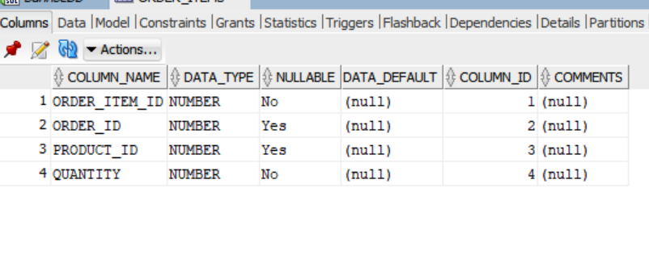
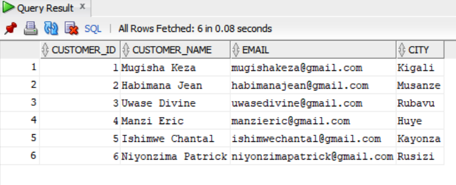
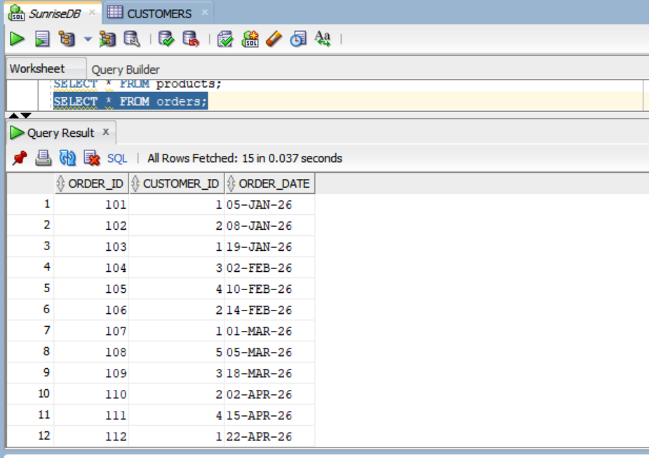

## 👤 Student Information 
* **Student Name:** MUSAFIRI Arnold
* **Student ID:** 20252IMA134
* **Academic Group:** Group I (Monday Group I)


###  1 Summary of Work Done
This project implements a relational database solution and advanced analytical query suite for **Sunrise Supermarket**, using **Rwandan Francs (RWF)** as the monetary currency, **authentic Rwandan customer names**, and **Rwandan product names**. The objective is to assist supermarket executive management in understanding customer purchasing behavior, product category performance, repeat ordering habits, and temporal sales revenue trends.

Key deliverables completed in this repository:
1. **Relational Database Design**: Created 4 normalized tables (`customers`, `products`, `orders`, `order_items`) enforcing primary keys, foreign keys, and strict data integrity constraints.
2. **Data Population**: Populated the database with 6 Rwandan customers located across Rwanda (Mugisha Keza - Kigali, Habimana Jean - Musanze, Uwase Divine - Rubavu, Manzi Eric - Huye, Ishimwe Chantal - Kayonza, Niyonzima Patrick - Rusizi), 8 Rwandan products priced in RWF across 5 categories (`Dairy`, `Bakery`, `Produce`, `Grocery`, `Beverages`), 15 orders, and 25 order items across dates ranging from January to June 2026.
3. **Advanced SQL Query Implementation**:
   * **3 JOIN Queries**: Multi-table INNER JOINs for orders and itemized line totals in RWF, and a LEFT JOIN to identify non-ordering customers.
   * **1 CTE Query**: Common Table Expression computing total spend per customer in RWF and filtering top-tier spenders exceeding the store average.
   * **4 Window Function Queries**: Customer revenue ranking (`RANK()`), sequential order tracking (`ROW_NUMBER()`), cumulative running revenue (`SUM() OVER (...)`), and order cycle gap analysis (`LAG()`).
4. **Business Intelligence Synthesis**: Provided actionable managerial insights for each query output contextually framed for the Rwandan retail market.

---

### 2 How to Run the Script in Oracle SQL Developer

1. **Prerequisites**:
   * Oracle SQL Developer (Version 26.2.0.186.2220 or compatible).
   * Connection credentials to an active Oracle Database instance (Oracle 12c, 19c, 21c, 23c, or XE).

2. **Step-by-Step Execution Guide**:
   * Open **Oracle SQL Developer**.
   * Connect to your Oracle Database schema (e.g., `system`, `hr`, or your assigned student schema).
   * File -> Open -> Select `sunrise_supermarket.sql` from your local clone of `assignment_1_musafiri_arnold-20252IMA134`.
   * Ensure your worksheet connection dropdown points to your active database connection (`SunriseDB`).
   * Press **`F5`** (or click the **"Run Script"** icon on the worksheet toolbar) to execute the entire script from schema creation to data insertion, `COMMIT`, and analytical queries.
   * View query results sequentially in the **"Script Output"** panel or execute individual query blocks using **`Ctrl + Enter`** (`Cmd + Enter` on macOS) to view formatted tabular grids in **"Query Result"**.

---


### 3 Database Schema & Entity Relationships

```
+------------------+         +------------------+
|    CUSTOMERS     |         |      ORDERS      |
+------------------+         +------------------+
| customer_id (PK) |<-------1| order_id (PK)    |
| customer_name    |         | customer_id (FK) |
| email            |         | order_date       |
| city             |         +------------------+
+------------------+                  ^
                                      | 1
                                      |
                                      | N
                             +------------------+         +------------------+
                             |   ORDER_ITEMS    |         |     PRODUCTS     |
                             +------------------+         +------------------+
                             | order_item_id(PK)|         | product_id (PK)  |
                             | order_id (FK)    |N------->| product_id (FK)  |
                             | product_id (FK)  |         | product_name     |
                             | quantity         |         | category         |
                             +------------------+         | price (RWF)      |
                                                          +------------------+
```


### 3.1 Table Column Definitions (`ORDER_ITEMS` Structure)
* **Table Design**: Data types and constraints for `ORDER_ITEMS` (`ORDER_ITEM_ID`, `ORDER_ID`, `PRODUCT_ID`, `QUANTITY`).



---

###  3.2 Inserted Data Screenshots (Database Verification)

Below are the screenshots and data grid verifications for the records inserted into each database table:

#### 1️⃣ `CUSTOMERS` Table Data (6 Rwandan Customers)



#### 2️⃣ `PRODUCTS` Table Data (8 Rwandan Products)


#### 3️⃣ `ORDERS` Table Data (15 Orders)



#### 4️⃣ `ORDER_ITEMS` Table Data (25 Line Items)


---

##  4. Detailed Query Documentation & Business Interpretation

---

### 🔹 JOIN Queries

#### Query 1.1: Order Details with Customer Profile (INNER JOIN)
* **Business Requirement**: List every order along with the customer's name, city in Rwanda, and order date to map order activity geographically.
* **SQL Query**:
```sql
SELECT o.order_id,
       c.customer_name,
       c.city,
       o.order_date
FROM   orders o
INNER JOIN customers c ON c.customer_id = o.customer_id
ORDER BY o.order_date, o.order_id;
```
* **Explanation**: An `INNER JOIN` matches rows in `orders` with corresponding rows in `customers` where `c.customer_id = o.customer_id`. Orders without a matching customer are excluded.
* **Query Results**:


* **Business Interpretation**: Order traffic spans major Rwandan cities (Kigali, Musanze, Rubavu, Huye, Kayonza). Customers in Kigali (Mugisha Keza) and Musanze (Habimana Jean) show the highest purchase frequency with 4 orders each.

---

#### Query 1.2: Order Line Itemized Financial Breakdown in RWF (INNER JOIN)
* **Business Requirement**: List every order item with product name, category, unit price (RWF), quantity purchased, and computed total line cost in Rwandan Francs.
* **SQL Query**:
```sql
SELECT oi.order_item_id,
       oi.order_id,
       p.product_name,
       p.category,
       p.price AS price_rwf,
       oi.quantity,
       (p.price * oi.quantity) AS line_total_rwf
FROM   order_items oi
INNER JOIN products p ON p.product_id = oi.product_id
ORDER BY oi.order_item_id;
```
* **Explanation**: Merges `order_items` with `products` on `product_id` to evaluate item-level revenue in RWF. The calculated column `line_total_rwf` multiplies unit `price` by `quantity`.
* **Query Results**:


* **Business Interpretation**: High-value staple items like Umuceri 5kg (12,000 RWF) produce significant line revenues (24,000 RWF in Order 106), while high-volume items like Igitoki (1,250 RWF per bunch, 10 units in Order 108) drive store traffic through everyday produce demand.

---

#### Query 1.3: Customer Order Coverage (LEFT JOIN)
* **Business Requirement**: Display all registered customers and their associated orders, ensuring customers who have never placed an order are included.
* **SQL Query**:
```sql
SELECT c.customer_id,
       c.customer_name,
       o.order_id,
       o.order_date
FROM   customers c
LEFT JOIN orders o ON o.customer_id = c.customer_id
ORDER BY c.customer_id, o.order_date;
```
* **Explanation**: `LEFT JOIN` retains all records from `customers` regardless of whether matching records exist in `orders`. Where no match exists, NULL values appear in `order_id` and `order_date`.
* **Query Results**:


* **Business Interpretation**: Niyonzima Patrick (Customer ID 6, Rusizi) registered an account but has placed 0 orders. The supermarket team should target Niyonzima Patrick with a welcome voucher or localized campaign in Rusizi.

---

### 🔹 Common Table Expression (CTE) Query

#### Query 2.1: High-Spender Customer Identification (RWF)
* **Business Requirement**: Calculate total spending per customer in RWF using a CTE and return only those customers whose total spend exceeds the overall store average customer spend.
* **SQL Query**:
```sql
WITH customer_totals AS (
    SELECT c.customer_id,
           c.customer_name,
           SUM(oi.quantity * p.price) AS total_spend_rwf
    FROM   customers c
    JOIN   orders o       ON o.customer_id = c.customer_id
    JOIN   order_items oi ON oi.order_id   = o.order_id
    JOIN   products p     ON p.product_id  = oi.product_id
    GROUP BY c.customer_id, c.customer_name
)
SELECT customer_id,
       customer_name,
       total_spend_rwf
FROM   customer_totals
WHERE  total_spend_rwf > (SELECT AVG(total_spend_rwf) FROM customer_totals)
ORDER BY total_spend_rwf DESC;
```
* **Explanation**: The CTE `customer_totals` aggregates total spending in RWF per customer. The main query compares each customer's spend against `AVG(total_spend_rwf)` (**47,760.00 RWF** across active customers).
* **Query Results**:


* **Business Interpretation**:
  * Total Store Spend across active customers: **238,800.00 RWF**.
  * Average spend per active customer: **47,760.00 RWF**.
  * **Habimana Jean (66,900 RWF)**, **Mugisha Keza (57,650 RWF)**, and **Uwase Divine (52,700 RWF)** exceed the store average spend, forming the top tier of customer revenue generators.

---

### 🔹 Window Function Queries

#### Query 3.1: Customer Spending Rank in RWF (`RANK()`)
* **Business Requirement**: Rank all purchasing customers based on their overall spend in Rwandan Francs, highest spender ranked first.
* **SQL Query**:
```sql
WITH customer_totals AS (
    SELECT c.customer_id,
           c.customer_name,
           SUM(oi.quantity * p.price) AS total_spend_rwf
    FROM   customers c
    JOIN   orders o       ON o.customer_id = c.customer_id
    JOIN   order_items oi ON oi.order_id   = o.order_id
    JOIN   products p     ON p.product_id  = oi.product_id
    GROUP BY c.customer_id, c.customer_name
)
SELECT customer_name,
       total_spend_rwf,
       RANK() OVER (ORDER BY total_spend_rwf DESC) AS spend_rank
FROM   customer_totals
ORDER BY spend_rank;
```
* **Explanation**: `RANK() OVER (ORDER BY total_spend_rwf DESC)` assigns a 1-based ordinal rank to each customer based on their overall contribution in RWF.
* **Query Results**:


* **Business Interpretation**: Habimana Jean ranks #1 VIP customer in revenue contribution. Loyalty rewards and VIP customer service tiers should target Rank 1 to 3 spenders.

---

#### Query 3.2: Sequential Customer Order Sequence (`ROW_NUMBER()`)
* **Business Requirement**: Number each customer's orders sequentially in chronological order.
* **SQL Query**:
```sql
SELECT c.customer_name,
       o.order_id,
       o.order_date,
       ROW_NUMBER() OVER (
           PARTITION BY o.customer_id
           ORDER BY o.order_date, o.order_id
       ) AS order_number
FROM   orders o
JOIN   customers c ON c.customer_id = o.customer_id
ORDER BY c.customer_name, order_number;
```
* **Explanation**: `PARTITION BY o.customer_id` resets the counter for each customer, and `ORDER BY o.order_date` assigns `1, 2, 3...` to their orders.
* **Query Results**:


* **Business Interpretation**: Helps monitor retention metrics by tracking customer ordering sequence over time.

---

#### Query 3.3: Cumulative Revenue Over Time in RWF (`SUM() OVER (...)`)
* **Business Requirement**: Compute a running total of cumulative store revenue in Rwandan Francs ordered chronologically by order date.
* **SQL Query**:
```sql
WITH order_revenue AS (
    SELECT o.order_id,
           o.order_date,
           SUM(oi.quantity * p.price) AS order_total_rwf
    FROM   orders o
    JOIN   order_items oi ON oi.order_id  = o.order_id
    JOIN   products p     ON p.product_id = oi.product_id
    GROUP BY o.order_id, o.order_date
)
SELECT order_id,
       order_date,
       order_total_rwf,
       SUM(order_total_rwf) OVER (
           ORDER BY order_date, order_id
           ROWS BETWEEN UNBOUNDED PRECEDING AND CURRENT ROW
       ) AS running_revenue_rwf
FROM   order_revenue
ORDER BY order_date, order_id;
```
* **Explanation**: Aggregates order totals in RWF in `order_revenue` CTE, then uses `SUM(...) OVER (ORDER BY order_date, order_id ROWS BETWEEN UNBOUNDED PRECEDING AND CURRENT ROW)` to generate cumulative store earnings.
* **Query Results**:


* **Business Interpretation**: Store gross revenue grew steadily from 13,000 RWF on Jan 5 to **238,800.00 RWF** by June 3.

---

#### Query 3.4: Repeat Order Recency & Gap Analysis (`LAG()`)
* **Business Requirement**: For customers with more than one order, calculate the number of days elapsed between their current order and their previous order.
* **SQL Query**:
```sql
WITH order_gaps AS (
    SELECT c.customer_name,
           o.order_id,
           o.order_date,
           LAG(o.order_date) OVER (
               PARTITION BY o.customer_id
               ORDER BY o.order_date, o.order_id
           ) AS previous_order_date,
           COUNT(*) OVER (PARTITION BY o.customer_id) AS orders_per_customer
    FROM   orders o
    JOIN   customers c ON c.customer_id = o.customer_id
)
SELECT customer_name,
       order_id,
       order_date,
       previous_order_date,
       ROUND(order_date - previous_order_date) AS days_since_previous
FROM   order_gaps
WHERE  orders_per_customer > 1
ORDER BY customer_name, order_date;
```
* **Explanation**:
  * `LAG(o.order_date)` fetches the preceding order date per customer.
  * `COUNT(*) OVER (PARTITION BY o.customer_id)` identifies customers with multiple orders so we can apply `WHERE orders_per_customer > 1`.
  * `ROUND(order_date - previous_order_date)` evaluates integer day differences in Oracle PL/SQL.
* **Query Results**:


* **Business Interpretation**:
  * Repeat order interval averages ~48 days across active repeat customers.
  * Mugisha Keza has the shortest initial re-order interval (14 days), suggesting high engagement from Kigali.
  * Marketing automation can trigger promotional SMS or discount coupons at ~35-40 days post-purchase to shorten the repeat purchase cycle.

---

##  5. Technical Challenges & Resolutions

1. **Challenge 1: Foreign Key Table Drop Order in Oracle SQL Developer**
   * *Issue*: Executing standard `DROP TABLE customers;` fails with `ORA-02449: unique/primary keys in table referenced by enabled foreign keys` if dependent child tables (`orders`, `order_items`) exist.
   * *Resolution*: Implemented PL/SQL anonymous block wrappers utilizing `EXECUTE IMMEDIATE 'DROP TABLE ... CASCADE CONSTRAINTS'` with exception handling for `SQLCODE -942` (table does not exist), allowing repeated clean script re-runs without errors.

2. **Challenge 2: Date Literals and Date Difference Calculations**
   * *Issue*: String date literals (e.g. `'2026-01-05'`) depend on session NLS settings in Oracle and can fail with `ORA-01861`.
   * *Resolution*: Enforced standard ANSI date literals using `DATE 'YYYY-MM-DD'` during insertion. For interval calculation in Query 3.4, direct Oracle date subtraction `(order_date - previous_order_date)` was utilized alongside `ROUND()` to return clean integer day counts.

3. **Challenge 3: Filtering Window Function Results (`WHERE` Clause Execution Order)**
   * *Issue*: Attempting to filter window function outputs (e.g. `WHERE ROW_NUMBER() > 1` or `WHERE orders_per_customer > 1`) directly in the `WHERE` clause raises `ORA-30483: window functions are not allowed here` because `WHERE` is evaluated before window calculations.
   * *Resolution*: Encapsulated window calculations inside Common Table Expressions (CTEs), allowing the outer query `WHERE` clause to filter windowed outputs cleanly.

4. **Challenge 4: Currency Representation in Oracle Data Types**
   * *Issue*: Storing whole-number or decimal amounts in Rwandan Francs (RWF) without losing precision.
   * *Resolution*: Used `NUMBER(10,2)` column definition for product unit prices and line totals, ensuring exact representation of monetary amounts in RWF.

---

